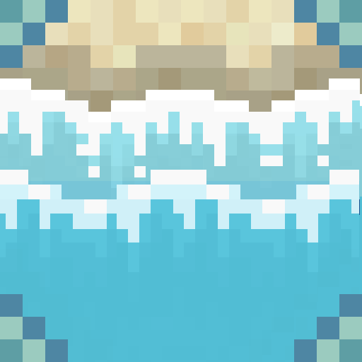

<div align="center">



# 🌊 Forge-Wavify

### Ambient ocean &amp; beach waves for Minecraft — on Forge.

[](https://www.minecraft.net/)
[](https://files.minecraftforge.net/)
[](https://adoptium.net/)
[](LICENSE)
[](#-compatibility)

</div>

---

> **Rolling swells, crashing shorebreak, and drifting sea-spray that make Minecraft's coastlines feel alive** — the *Wavify* wave mod, faithfully ported to **MinecraftForge** for the **26.1** generation.

Beaches and oceans in vanilla Minecraft are flat and still. **Forge-Wavify** scans the water around you and spawns animated waves that roll toward the shore, swell up near beaches, break against the terrain, and toss spray and foam into the air — all client-side, with zero impact on your server.

<br/>

## ✨ Features

- 🌊 **Living coastlines** — waves roll toward and break against beaches, shores, and rocky terrain
- 🏝️ **Open water &amp; islands** — gentle swells spawn around islands and across large bodies of water
- 💦 **Spray, splash &amp; foam** — crashing and washing-up waves throw water particles and leave foam
- 🎨 **Biome-aware** — every wave is tinted to match its biome's water color
- 🌕 **Full-moon glow** — waves shimmer brightly on full-moon nights
- 🪨 **Wet sheen** — a subtle overlay is left on blocks the waves wash over
- ⚙️ **Tunable performance** — configurable render radius and rescan rate
- 🧭 **Debug visualizers** — optional spyglass/compass overlays to see how waves are generated
- 📡 **Client-side only** — install it on your client and join *any* vanilla or modded server

<br/>

## 📸 Screenshots

> _Coming soon — drop your own captures in a `docs/` folder and link them here._

<br/>

## 📥 Installation

1. Make sure you're on **Minecraft 26.1.x** with **Java 25** (shipped with the game).
2. Install **MinecraftForge** for your exact version (see [Compatibility](#-compatibility)).
3. Download the latest `forge-wavify` jar from the [**Releases**](../../releases) page.
4. Drop it into your `mods/` folder.
5. Launch the game and head to a beach or ocean — the waves roll in on their own. 🌊

<br/>

## 🧩 Compatibility

| Minecraft | Forge | Status |
|:--|:--|:--|
| **26.1.2** | `64.x` | ✅ Built &amp; tested |
| **26.1.1** | `63.x` | 🟢 Same drop &amp; APIs — should work |
| **26.1** | `62.x` | 🟢 Same drop &amp; APIs — should work |

One jar covers the whole **26.1 drop**. Older Minecraft (≤ 1.21.x) and the next drop (26.2+) use different APIs and would need a separate build. Forge-Wavify is **client-side only** (`clientSideOnly=true`) — it never has to be installed on a server.

<br/>

## ⚙️ Configuration

Settings live in `config/wavify-client.toml`:

| Option | Default | Range | Description |
|:--|:--|:--|:--|
| `chunkRadius` | `5` | `3`–`16` | Radius (in chunks) around you that spawns waves. Lower it for more FPS. |
| `chunkUpdatesRescanAmount` | `50` | `1`–`1024` | Block updates in a chunk before it's rescanned for waves. |
| `debug` | `false` | — | Enables debug visualizers (hold a spyglass/compass to inspect wave generation). |

Prefer an in-game options screen with sliders? Install the optional [**Configured**](https://www.curseforge.com/minecraft/mc-mods/configured) mod, which builds a GUI from the config automatically.

<br/>

## 🛠️ Building from source

```bash
git clone https://github.com/BlankDEVgit/Forge-Wavify.git
cd Forge-Wavify
./gradlew build          # → build/libs/wavify-1.0.0.jar
./gradlew runClient      # launch a dev client with the mod loaded
```

Requires the **Java 25** toolchain (Gradle auto-provisions it) and **Gradle 9.3.1+** (the included wrapper handles this). Built with **ForgeGradle 7**.

<br/>

<details>
<summary><b>🔬 Developer / porting notes</b></summary>

<br/>

This is a port of the **Wavify** client mod from **Fabric** to **classic MinecraftForge**. The wave simulation, rendering, chunk scanning, and particles are faithful to the original; only the loader-specific glue was rewritten. Minecraft 26.1+ ships **de-obfuscated** (real names, no SRG), so every `net.minecraft.*` reference is identical between loaders — no remapping, no Mixin refmap.

| Concern | Fabric original | Forge port |
|:--|:--|:--|
| Entry point | `ModInitializer` / `ClientModInitializer` | `@Mod` class + `@Mod.EventBusSubscriber(value=Dist.CLIENT)` (no `bus` → auto-routes) |
| Metadata | `fabric.mod.json` (`environment: client`) | `META-INF/mods.toml` (`clientSideOnly=true`) |
| Access widener | `wavify.accesswidener` | `META-INF/accesstransformer.cfg` |
| Particle types | `FabricParticleTypes` + `Registry.register` | eager `ParticleType` fields + `RegisterEvent` |
| Particle providers | `ParticleProviderRegistry` | `RegisterParticleProvidersEvent#registerSpriteSet` |
| Level tick | `ClientTickEvents.END_LEVEL_TICK` | `TickEvent.LevelTickEvent.Post` |
| Chunks | `ClientChunkEvents.CHUNK_LOAD/UNLOAD` | `ChunkEvent.Load` / `Unload` |
| World render | `LevelRenderEvents.AFTER_TRANSLUCENT_TERRAIN` | `AddFramePassEvent` (FrameGraph) |
| Resource reload | `SimpleResourceReloadListener` | `PreparableReloadListener` + `RegisterClientReloadListenersEvent` |
| Config | midnightlib (`MidnightConfig`) | `ForgeConfigSpec` (no classic-Forge midnightlib for 26.1) |

**Forge 26.1 (build 64.x) notes:** it runs on **EventBus 7** (record events; `@SubscribeEvent` in `…eventbus.api.listener`; mod bus is a `BusGroup` via `getModBusGroup()`; events are strictly bound to one bus group — omit the `@EventBusSubscriber` `bus` param to auto-route) and the **FrameGraph** render pipeline (`RenderLevelStageEvent` was removed in favour of `AddFramePassEvent`).

**Known runtime note:** the wave-render FrameGraph pass (`WavifyClientForgeEvents#onAddFramePass`) is the one spot worth eyeballing in-game — if waves ever layer oddly against clouds/weather/water, the fix is the target binding in that single method. Everything else is verified by a clean compile + load (mod constructs, mixin injects, atlas stitches, no errors).

</details>

<br/>

## 🙌 Credits &amp; acknowledgements

- **Forge port — [BlankDEVgit](https://github.com/BlankDEVgit)** (this project).
- Based on the **Wavify** mod by **icywhenhot**, itself a fork of **Tidal** by **Superkat32** — the original wave system, art, and gameplay concept are theirs. 💙

<br/>

## 📄 License

Released under the [**MIT License**](LICENSE).
